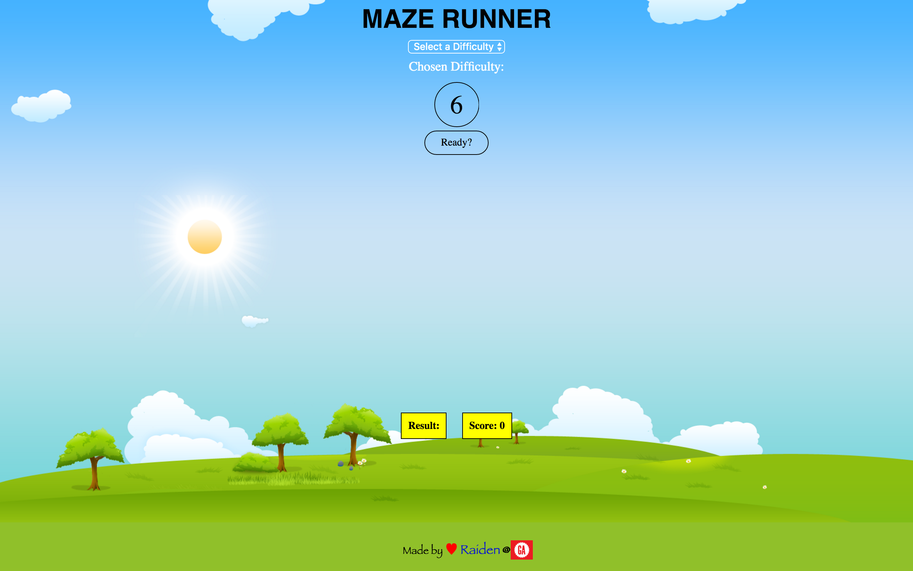
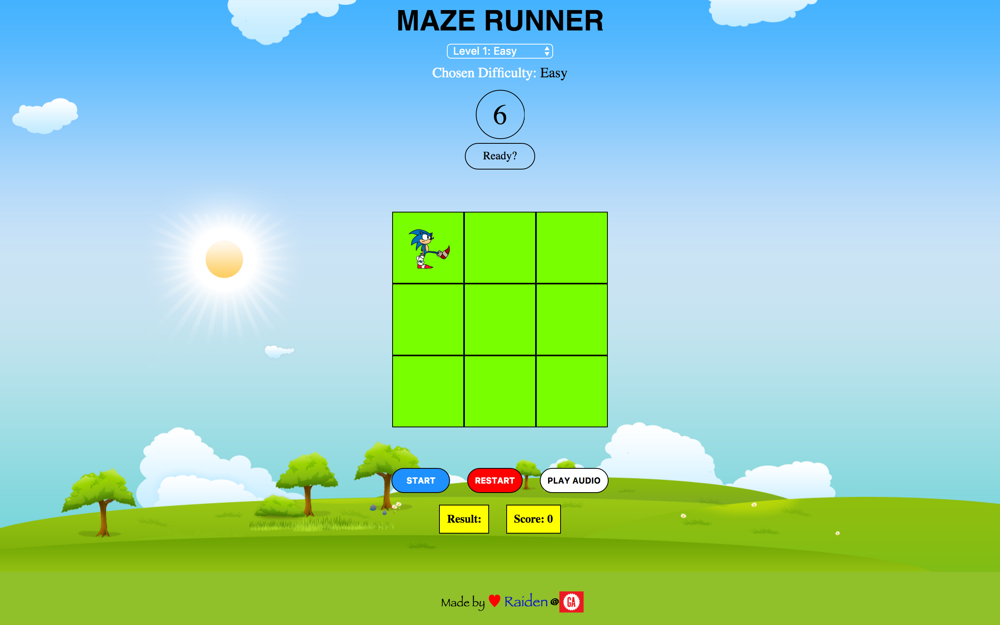
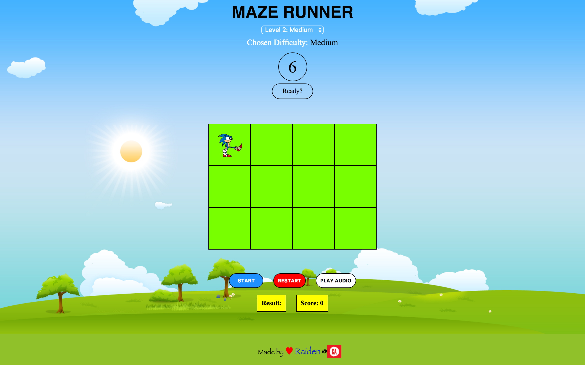
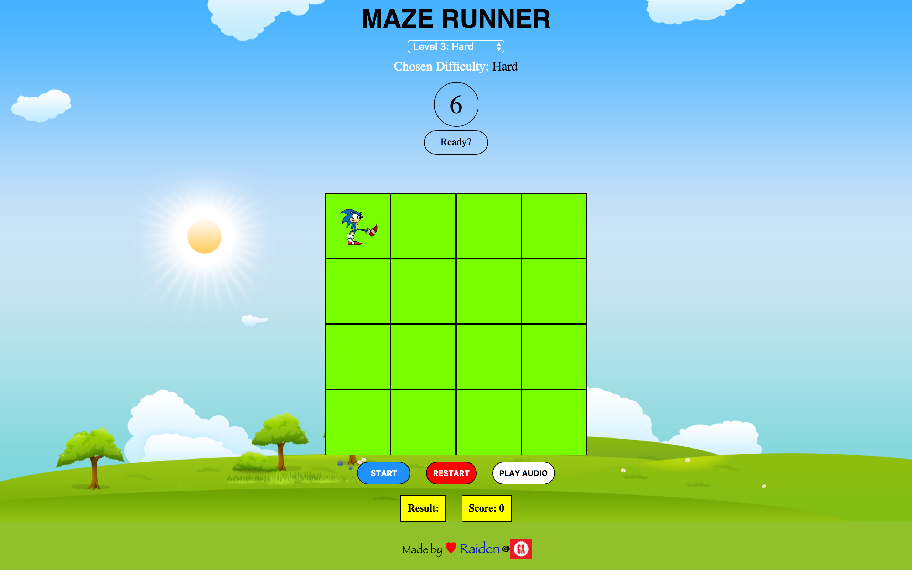

#	GA London WDI 25

<h1>Project 1: Maze Runner</h1>

#####[Play it here!](https://afternoon-woodland-32796.herokuapp.com/ "Here!")

<h2>Game Instructions</h2>

* Instructions are straight forward. Up, Down, Left, Right on a desktop.
* And on iPhone and iPad it's swiping instead of a visual button.

<h2>How it works</h2>

* It's simple you choose a difficulty you then click the start button and you try to get to the finish point. Beaware that there are walls so if you run into them you will strt again from the beginning of maze.
* If you finish the maze before the timer runs out, your remaining time will be added to your score.

<h2>Project Workflow</h2>

* I started out with pseudocoding my game.
* I used wireframing
* I used git hub and commited several times during each day.

<h2>Technical Requirements</h2>

* I met all of the requirements of the project.
* I Used all the tools that I learned in class and used documentations and used forums stackoverflow.
* I built a reasonably complex game and it looks easy to play but there are different difficulty levels.

<h2>Creativity</h2>

* So I used a Gif for my character to give a personal touch to my game.
* Used animations to make the game look more fun and added a background audio.
* Animation was created using the Animate.css stylesheet.

<h2>Code Quality</h2>

#####I followed all the code guidelines such as:

1. Semantic naming
2. Modularity
3. Refactoring
4. Commenting out codes that might come in handy later on.
5. Commenting out what certain lines or functions do.
6. HTML 5, CSS and jQuery were used to create this game.
6. Responsive CSS

<h2>Deployment</h2>

* I have deployed my game to Heroku for everyone who wants to test it, either to test game complexity or just for fun.

<h2>Snapshots</h2>

<h3>Level 1: Easy</h3>

<h3>Level 2: Hard</h3>

<h3>Level 3: Hard</h3>

Made by Raiden @ General Assembly